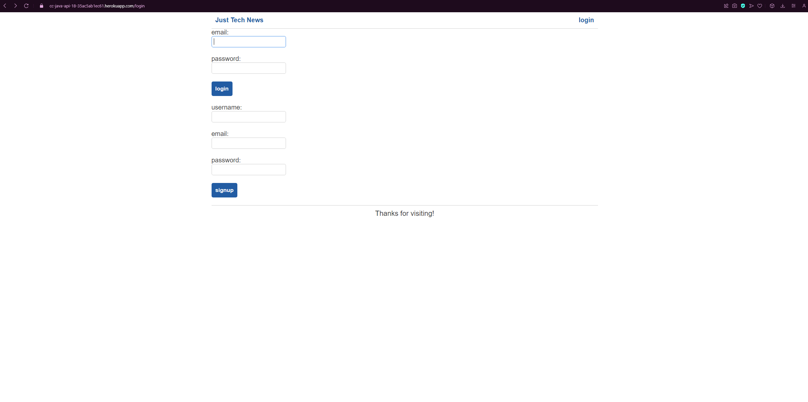

# Just Tech News Java

## Description

A place where likeminded tech users can share posts for others to see.

## Screenshot

## Deployed Application

https://cc-java-api-18-35ac5ab1ec61.herokuapp.com

## Table of Contents

- [Installation](#installation)
- [Usage](#usage)
- [License](#license)
- [How to Contribute](#contributing)
- [Test](#test)
- [Questions](#questions)

## Installation

N/A

## Usage

Navigate to the page where you can create an account. Once created you can then create your own posts, and comment and upvote other user's posts

## License

MIT License

## Contributing

N/A

## Test

N/A

## Questions

My Github account is [GitHub.com/midasantiago](github.com/midasantiago)

If you wish to contact me you can do so at mida.santiago98@gmail.com